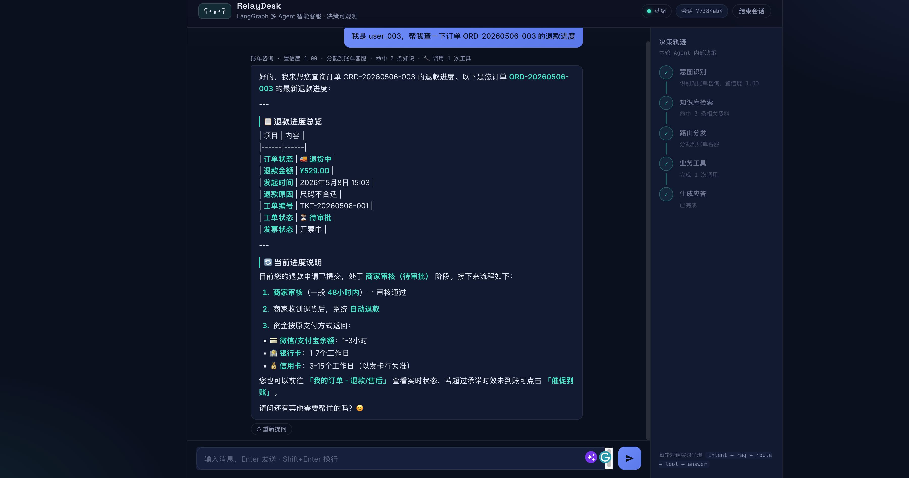
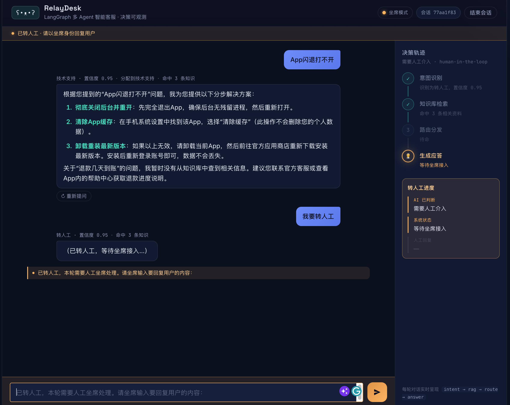

# RelayDesk · LangGraph 多 Agent 智能客服

**RelayDesk** 是一个用 **LangGraph** 从零搭建的多 Agent 客服系统：意图识别 → RAG 检索 → 多 Agent 条件路由 → 业务工具调用 → 敏感操作人工审批 → 持久化记忆 → 自动评测 → 可视化 Web 界面。

> 项目以分阶段方式构建（见 git 提交历史），每个阶段一个可独立讲清的能力。完整技术文档见 [`langgraph_cs/README.md`](langgraph_cs/README.md)。



> 「Agent 控制台」深色界面：左侧对话区，右侧「决策轨迹」随每轮 SSE 事件**实时点亮**（意图识别 → 知识检索 → 路由分发 → 生成应答），把 Agent 内部决策做成界面 signature。（截图为四阶段版界面；当前版本已增加第五阶段「业务工具」与审批模式，截图待更新。）

**转人工（human-in-the-loop）**：说一句「转人工」，整张图暂停、界面切坐席模式等人工接管：



> 截图为四阶段版坐席模式；当前版本已增加第五阶段「业务工具」与退款审批模式，截图待更新。

## 能力一览

| 模块 | 能力 | 关键技术 |
|---|---|---|
| 编排 | `intent → rag → 条件路由 → 专职 Agent` | LangGraph `StateGraph` + `add_conditional_edges` |
| 多 Agent | 技术 / 账单 / 通用 / 转人工，低置信降级 + 运行时兜底 | 条件路由 + 双层降级 |
| 工具调用 | billing/technical 挂真实业务工具（查账单/退款进度/建工单），ToolNode 循环 + 失败降级 | `bind_tools` + `ToolNode` + 条件边回流 |
| 人工审批 | 退款创建前 `interrupt()` 暂停等人工批准/驳回，批准才落库 | interrupt payload kind 协议 + Web 审批模式 |
| 人工介入 | 转人工时图暂停、坐席输入后恢复 | `interrupt()` + `Command(resume=...)` |
| RAG | 知识库检索 + rerank，可量化对比 | 硅基流动 embedding/rerank + Chroma + BM25 对照 |
| 记忆 | 多轮上下文，重启不失忆 | `MemorySaver` / `SqliteSaver` checkpointer |
| 评测 | 检索层指标 + 端到端答案质量（LLM-judge）+ LangSmith | 自建测试集 / `langsmith` |
| 前端 | 决策轨迹实时可视化、流式打字、坐席模式 | FastAPI + 原生 HTML/JS（SSE） |

**实测数据**：RAG 在弱检索器(BM25)下 rerank 把 Hit@1 87.3%→92.7%、MRR 0.873→0.927；端到端答案质量（DeepSeek-judge）准确性 4.92 / 有用性 4.85（满分 5）；工具调用基线集 22–24/24（最新单次 23/24，LLM 非确定，两条技术样本在“先查服务状态”上摇摆）。对抗集曾以 13/15 暴露工具层无鉴权、显式“别查系统”误触发、条件多意图未自动编排；本步已修工具层归属鉴权，最新 hard 回归 15/15（本次采样未触发“别查系统”误调用，known gap 仍保留；Web/CLI 登录态接线属后续）。

## 快速开始

```bash
# 1. 建虚拟环境 + 装依赖
python3 -m venv langgraph_cs/.venv
langgraph_cs/.venv/bin/python -m pip install -r langgraph_cs/requirements.txt

# 2. 配置 key：复制模板后填入
cp langgraph_cs/.env.example langgraph_cs/.env
#   编辑 langgraph_cs/.env，填 DEEPSEEK_API_KEY（对话）与 SILICONFLOW_API_KEY（embedding/rerank）

# 3. 灌知识库 + mock 业务库（RAG / 工具演示必需，一次即可）
langgraph_cs/.venv/bin/python -m langgraph_cs.scripts.ingest_faq
langgraph_cs/.venv/bin/python -m langgraph_cs.scripts.seed_business_db

# 4a. Web 界面（推荐）
langgraph_cs/.venv/bin/python -m langgraph_cs.web   # 浏览器开 http://127.0.0.1:8000
# 4b. 命令行
langgraph_cs/.venv/bin/python -m langgraph_cs.main
```

> 务必从仓库根目录用 `-m` 模块方式运行。技术栈：LangGraph · DeepSeek · 硅基流动 · Chroma · BM25 · FastAPI。

### 可选：以标准包方式安装（控制台入口命令）

仓库根目录提供了 `pyproject.toml`，可把项目当作标准 Python 包安装，从而用更短的入口命令启动（`python -m langgraph_cs.web` 等原有方式仍然可用）：

```bash
# 在已建好的 venv 里安装（-e 可编辑安装，改代码即时生效）
langgraph_cs/.venv/bin/python -m pip install -e .

# 装好后多出两个控制台命令：
langgraph-cs-web    # 启动 Web 界面（等价于 python -m langgraph_cs.web）
langgraph-cs        # 启动命令行对话（等价于 python -m langgraph_cs.main）
```

> 需要可复现的精确依赖版本时，用仓库根的 `requirements.lock`（`pip freeze` 产物）：
> `langgraph_cs/.venv/bin/python -m pip install -r requirements.lock`。
